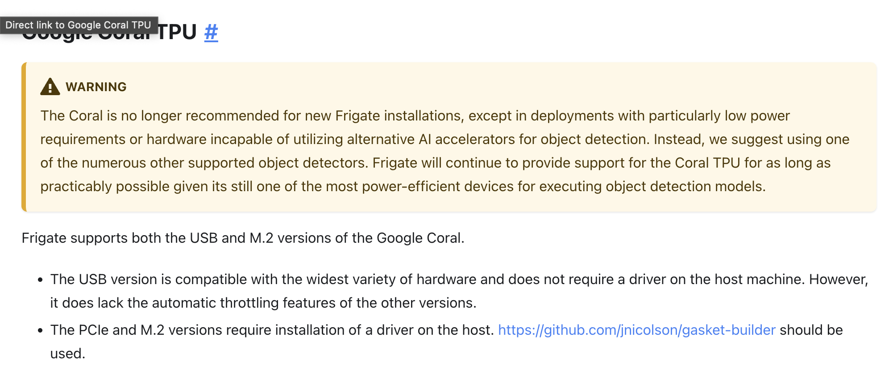

# Introduction

This document is meant to show how to install and run a docker container for Frigate NVR.


> [!WARNING]
> This document will not depict Windows or a NAS install, as I have neither. A PR with support for it afterwards is welcomed.

> [!WARNING]
> This document is limited to the hard I have, which is a Lenovo `10T700ARMH` ThinkCentre M720q with an Intel `i5-9500T` CPU and an Intel `CoffeeLake-S GT2 [UHD Graphics 630]` video chip. 
> If you have an AMD setup it _should_ work the same way, but your mileage may vary.
> Use the command `inxi -GCM` to find out your system, or `inxi -F` for the total overview. [How to install inxi](https://linuxconfig.org/installation-of-inxi-system-information-script-on-debian-wheezy).

[[_TOC_]]

# Requirements

## Debian Linux

You need to have Linux installed on a miniPC with an integrated video chipset.

You can find your install version info in multiple ways:

```bash
cat /etc/debian_version
13.4

uname -r
6.12.85+deb13-amd64

lsb_release -a
No LSB modules are available.
Distributor ID: Debian
Description:    Debian GNU/Linux 13 (trixie)
Release:        13
Codename:       trixie
```

## integrated GPU with CPU

The command `ls -l /dev/dri` should show a device `renderD128`:

```shell
rw-rw---- 1 root video  226,   0 Jun 26 22:22 card0
crw-rw---- 1 root render 226, 128 Jun 26 22:22 renderD128
```


> [!NOTE]
> There used to be a use for an edge TPU called "Google Coral", which would work from either an M2 or a USB connector.
> [One of the devs on reddits](https://www.reddit.com/r/frigate_nvr/comments/1os24t4/comment/nnyvk6s/) however says not to
> 
>     We no longer recommend the Coral for new installations. An Intel iGPU gives the best bang for the buck, providing excellent object detection with OpenVINO as well as support for hardware acceleration of Frigate's enrichments.
> 
> which is reflected in [the docs](https://docs.frigate.video/frigate/hardware/#google-coral-tpu)
> 

# Docker setup

Check the version of docker that you're running

```bash
docker --version
Docker version 29.4.2, build 055a478
```

If you don't have it installed, [follow their manual](https://docs.docker.com/engine/install/debian/#install-using-the-repository).

## Compose file

```yaml
version: '3.9'
services:
  frigate:
    name: frigate-recognition
    container_name: frigate-recognition
    privileged: true # Required for direct hardware access in some environments
    restart: unless-stopped
    image: ghcr.io/blakeblackshear/frigate:stable
    shm_size: "128mb" # Adjust based on your camera count and resolution
    devices:
      - /dev/dri/renderD128:/dev/dri/renderD128 # Passes Intel iGPU to the container
      - /dev/dri/card0:/dev/dri/card0
    volumes:
      - /etc/localtime:/etc/localtime:ro
      - /path/to/config:/config
      - /path/to/storage:/media/frigate
    ports:
      - "8971:8971"
      - "5000:5000"
    environment:
      FRIGATE_RTSP_PASSWORD: "your_password"
```      

# Frigate configuration

After you've started and stopped the docker container for the first time, there should now be a configuration file in the path that is mounted as `/config`, most likely `config.yml` .

```yaml
detectors:
  ov:
    type: openvino
    device: GPU
```