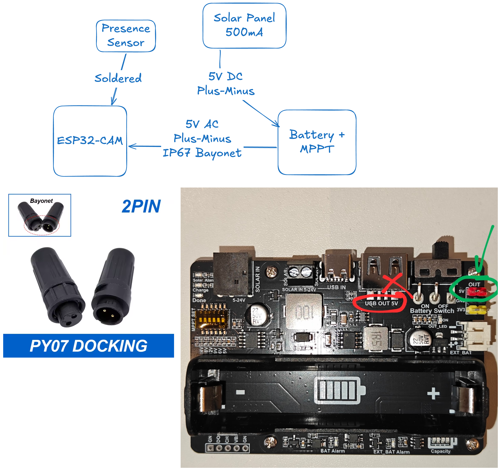

# Hardware & Wiring Guide

## Component list

| Component | Details |
|:-----------|:---------|
| Solar panel | [Generic 5V 500mA panels](https://www.amazon.nl/-/en/dp/B08RJV9JSG), Plus/Minus cable out |
| Power manager |[Xicoolee Solar Energy/Power Manager 5V-24V](https://www.amazon.nl/-/en/dp/B0BC1BN7T9) with MPPT and 18650 battery holder, Plus/Minus cable in, JST out |
| Battery | [POWO18B rechargeable](https://www.amazon.nl/dp/B0DS5JSVX4) 18650 batteries |
| Enclosure | [Camway IP67 storage box](https://www.amazon.nl/-/en/dp/B0G13FBN6W) |
| Microcontroller | [APKLVSR ESP32-CAM + ESP32-CAM MB WiFi/BT + ESP32 DC 5V](https://www.amazon.nl/-/en/dp/B0CHY9S2RK) |
| Camera | [OV5640 120deg camera](https://www.amazon.nl/-/en/dp/B0GW2NGQBW?ref=ppx_yo2ov_dt_b_fed_asin_title)  |
| Enclosure ESP32-CAM | [Found on Makerworld](https://makerworld.com/en/models/1239253-smart-bird-feeder-with-integrated-wifi-camera) | 

---

## Wiring overview



```
Solar panel (+) ──► Xicoolee IN+
Solar panel (−) ──► Xicoolee IN−

Xicoolee OUT JST (+, 5 V) ──► ESP32-CAM MB 5 V pin
Xicoolee OUT JST (−, GND) ──► ESP32-CAM MB GND pin

Battery voltage sense (optional, for low-battery sleep):
  100 kΩ from VBAT+ ──┬──► GPIO 33 (ADC1_CH5)
  100 kΩ to GND     ──┘
```

> **Note:** The ESP32-CAM MB board has a micro-USB socket and 5 V/GND header
> pins that accept the JST cable from the Xicoolee module directly (with the
> correct JST-PH 2-pin pigtail).

---

## Power budget

| State | Current draw | Notes |
|:-------|:-------------|:-------|
| Deep sleep | ~5–10 mA | Camera powered down, only RTC active |
| Wake + capture | ~180–250 mA peak | Camera + WiFi active (~3–5 s) |
| Idle WiFi | ~80–120 mA | WiFi up, camera off |

**5 V / 500 mA panel** produces up to 2.5 W.  With 30-second capture intervals
the duty cycle is roughly 5 s active / 25 s sleep, so average current is well
under 50 mA — comfortable for the panel output even on partly cloudy days.

---

## Battery notes

- The Xicoolee holder accepts standard 18650 cells; insert the POWO18B cells directly.
- The MPPT controller will cut off charging when the cell is full and resume
  when solar energy is available; no additional protection circuitry is needed.
- The firmware reads the raw battery voltage via a resistor divider on GPIO 33
  and extends the deep-sleep interval to 120 s when voltage drops below 3.5 V.

---

## Enclosure Electronics

Mount the solar panel outside the IP67 Camway box with a small cable gland
(M16 recommended) for the +/− wires entering the box.  Route the wires to the
Xicoolee board inside the sealed box.  Use the '5V' JST connector to route a powercable back out through the same cable gland.

---

## Enclosure Camera

The ESP32-CAM sits in the printed bird feeder with the OV5640 lens pointing through a small hole in the faceplate.
Use an [IP68 rated (bayonet) connector](https://www.prolech.nl/webshop/bedrading/kabelverbinders/12-24v-kabelverbinders/detail/2353/male--female---waterdichte-kabelverbinder---2-aderig---ip68.html) for easy (dis-)connection to the power board.

---

## Firmware

See [`firmware/bird_feeder_cam/`](../firmware/bird_feeder_cam/):

1. Edit **`config.h`** with your WiFi SSID, password, and upload URL.
2. Open `bird_feeder_cam.ino` in Arduino IDE (≥ 2.x).
3. Board: **AI Thinker ESP32-CAM** | Partition: **Huge APP (3 MB No OTA)**.
4. Flash via the ESP32-CAM MB USB port (hold IO0 low on first upload).
5. After flashing, remove the IO0 jumper and press reset.
